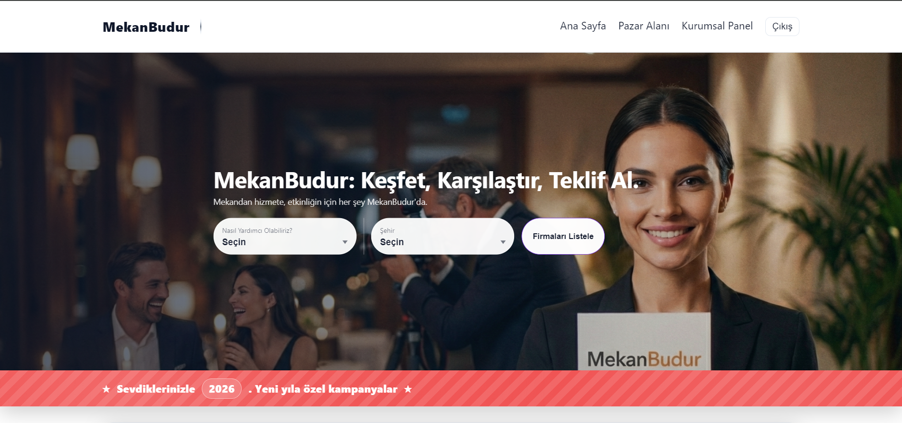

# MekanBudur - Özel Etkinlik Pazar Yeri Platformu




**MekanBudur**, etkinlik düzenleyiciler (kullanıcılar) ile hizmet sağlayıcıları (mekanlar, fotoğrafçılar, organizasyon firmaları vb.) buluşturan, konum tabanlı ve **"Ters Açık Artırma" (Reverse Auction)** modeline dayalı modern bir pazar yeri uygulamasıdır.

"Mekandan hizmete, etkinliğin için her şey MekanBudur'da."

---

## 📋 İçindekiler

- [Proje Hakkında](#-proje-hakkında)
- [Temel Özellikler](#-temel-özellikler)
- [Mimari Yapı](#-mimari-yapı)
- [Teknoloji Yığını](#-teknoloji-yığını)
- [Veritabanı Tasarımı](#-veritabanı-tasarımı)
- [Kurulum ve Çalıştırma](#-kurulum-ve-çalıştırma)
- [Kullanım Senaryoları](#-kullanım-senaryoları)

---

## 🚀 Proje Hakkında

Bu proje, geleneksel ilan sitelerinin aksine, kullanıcının ihtiyacını belirttiği ve hizmet sağlayıcıların bu ihtiyaca teklif verdiği bir yapı sunar. Mikroservis mimarisi prensipleriyle tasarlanmış olup, servisler arası iletişim ve konteynerizasyon (Docker) yapılarını pekiştirmek amacıyla geliştirilmiştir.

**Nasıl Çalışır?**
1. **Keşfet:** Kullanıcılar etkinlik türüne ve şehre göre arama yapar.
2. **Karşılaştır:** Hizmet sağlayıcıların profillerini ve puanlarını inceler.
3. **Teklif Al:** İlan oluşturarak tedarikçilerden fiyat teklifleri toplar.

---

## ✨ Temel Özellikler

- **Ters Açık Artırma (Reverse Auction):** İlan sahibi beklemede kalır, tedarikçiler işi almak için fiyat teklifi sunar.
- **Konum Tabanlı Keşif:** Leaflet.js entegrasyonu ile ilanlar ve mekanlar harita üzerinde görüntülenir.
- **Rol Bazlı Yönetim:**
  - **User (Kullanıcı):** İlan oluşturma, teklif değerlendirme, mekan yorumlama.
  - **Vendor (Hizmet Sağlayıcı):** Profil yönetimi, hizmet kategorileri belirleme, açık ilanlara teklif verme.
  - **Admin:** İçerik denetimi, kullanıcı/mekan silme ve platform yönetimi.
- **Hibrit Veri Yapısı:** Google Places API verileri ile yerel verilerin harmanlandığı hibrit harita sistemi.
- **Güvenlik:** JWT (JSON Web Token) tabanlı güvenli kimlik doğrulama.

---

## 🏗 Mimari Yapı

Proje, sorumlulukların ayrıldığı modüler bir yapıya sahiptir ve Docker üzerinde koşar:

1. **Main API Service (.NET):** Sistemin çekirdeğidir. Kimlik doğrulama, ilan yönetimi, teklif işlemleri ve veritabanı CRUD operasyonlarını yürütür.
2. **Geo Service (Microservice):** Konumsal hesaplamalar ve dış harita API'leri (Google Places) ile iletişimi sağlayan izole servis.
3. **Client (Web UI):** Vanilla JS ile geliştirilmiş, RESTful API ile haberleşen, responsive kullanıcı arayüzü.

---

## 🛠 Teknoloji Yığını

### Backend
- **Framework:** .NET 8 (Minimal API Mimarisi)
- **Dil:** C#
- **Veritabanı:** PostgreSQL (Npgsql)
- **ORM:** Entity Framework Core
- **Auth:** JWT Bearer Authentication

### Frontend
- **Dil:** JavaScript (ES6+ Vanilla - Frameworksüz)
- **Harita:** Leaflet.js & OpenStreetMap
- **Tasarım:** HTML5, CSS3 (Responsive Design)

### DevOps & Altyapı
- **Container:** Docker & Docker Compose
- **İletişim:** HTTP RESTful API

---

## 💾 Veritabanı Tasarımı

Sistem ilişkisel veritabanı (Relational DB) üzerine kuruludur. Ana varlıklar şunlardır:

* **Users:** Temel kimlik bilgileri ve Rol (User, Vendor, Admin).
* **VendorProfiles:** Hizmet sağlayıcılara ait detaylar (Kapasite, Hizmet Türleri, Görseller, Sosyal Medya Linkleri).
* **EventListings:** Kullanıcı ilanları. `EventListingItems` tablosu ile bire-çok ilişkiye sahiptir (Örn: Bir ilanda hem Fotoğrafçı hem Pastane olabilir).
* **Bids:** Verilen teklifler. `BidItems` ile hangi hizmete ne kadar fiyat verildiği tutulur.
* **Reviews & Ratings:** Mekan puanlama ve yorumlama sistemi.

---

## 💻 Kurulum ve Çalıştırma

Proje Docker ile çalışmaya hazırdır. Aşağıdaki adımları takip ederek projeyi yerel ortamınızda ayağa kaldırabilirsiniz.

### Gereksinimler
- Docker Desktop & Docker Compose
- .NET SDK 8.0 (Geliştirme yapılacaksa)

### Adımlar

1. **Repoyu Klonlayın:**
   ```bash
   git clone [https://github.com/hsyntinaztepe/mekanbudur-event-venue-finder.git](https://github.com/hsyntinaztepe/mekanbudur-event-venue-finder.git)
   cd mekanbudur-event-venue-finder
   
2. **Docker ile Ayağa Kaldırın:** Proje dizininde terminali açın ve şu komutu çalıştırın:
   ```bash
   docker-compose up --build
Bu işlem Veritabanı, Main API ve Geo Service konteynerlerini yapılandırıp başlatacaktır.

3. **Uygulamaya Erişin:**
- Web Arayüzü: http://localhost:8080
- Swagger API Dokümantasyonu: http://localhost:8081/swagger

## 📱 Kullanım Senaryoları

**Bir Etkinlik Sahibi Olarak (User):**

1-Sisteme kayıt olun ve giriş yapın.

2-"İlan Oluştur" butonuna tıklayın.

3-Haritadan etkinlik konumunu seçin, tarihi girin.

4-İhtiyaçlarınızı (örn: Düğün Salonu - 50.000 TL, Fotoğrafçı - 5.000 TL) ekleyip ilanı yayınlayın.

5-Gelen teklifleri "Tekliflerim" sayfasından yönetin ve en uygununu onaylayın.

**Bir Hizmet Sağlayıcı Olarak (Vendor):**

1-"Kurumsal Kayıt" ile işletmenizi kaydedin (Hizmet kategorilerinizi seçin).

2-"Kurumsal Panel" üzerinden profilinizi düzenleyin (Fotoğraf yükleyin, açıklama girin).

3-"Pazar Alanı"na giderek açık ilanları listeleyin.

4-Hizmet verebileceğiniz ilanlara fiyat teklifi gönderin.

## 👨‍💻 Geliştirici

**Hüseyin Tınaztepe**


